# AI Marketing Strategist - System Architecture

## Architecture Overview

The AI Marketing Strategist is a sophisticated multi-agent system built on LangGraph that transforms user prompts into comprehensive marketing content briefs through a sequential workflow of specialized agents.

## System Architecture Diagram

## Data Flow Architecture

```mermaid
flowchart LR
    %% Input Processing
    Input[User Prompt] --> Lang{Language<br/>Detection}
    Lang --> InitState[Initial State<br/>Creation]
    
    %% Sequential Processing Chain
    InitState --> Chain[Agent Processing Chain]
    
    subgraph "🔄 Processing Pipeline"
        A1[Prompt Analysis] --> A2[Post Classification]
        A2 --> A3[Brand Voice]
        A3 --> A4[Fact Grounding]
        A4 --> A5[Text Generation]
        A5 --> A6[Caption Creation]
        A6 --> A7[Visual Concept]
        A7 --> A8[Reasoning Module]
        A8 --> A9[Visual Format]
        A9 --> A10[Video Script]
        A10 --> A11[Result Optimization]
        A11 --> A12[Contextual Awareness]
    end
    
    Chain --> A1
    A12 --> Assembly[Brief Assembly]
    
    %% State Updates
    subgraph "📊 State Updates"
        StateUpdate[State Update<br/>After Each Agent]
        Timing[Timing Recording]
        ErrorHandling[Error Handling]
    end
    
    A1 -.-> StateUpdate
    A2 -.-> StateUpdate
    A3 -.-> StateUpdate
    A4 -.-> StateUpdate
    A5 -.-> StateUpdate
    A6 -.-> StateUpdate
    A7 -.-> StateUpdate
    A8 -.-> StateUpdate
    A9 -.-> StateUpdate
    A10 -.-> StateUpdate
    A11 -.-> StateUpdate
    A12 -.-> StateUpdate
    
    StateUpdate -.-> Timing
    StateUpdate -.-> ErrorHandling
    
    %% Final Output
    Assembly --> FinalBrief[📄 Final Content Brief]
    
    %% Output Components
    FinalBrief --> Components
    subgraph "📋 Brief Components"
        PostType[Post Type & Classification]
        Content[Core Content & Copy]
        Engagement[Engagement Elements]
        Visual[Visual Concepts]
        Voice[Brand Voice Guidelines]
        Facts[Factual Grounding]
        Strategy[Strategic Reasoning]
        Formats[Format Recommendations]
        Scripts[Video Scripts]
        Optimization[Performance Optimization]
        Context[Contextual Insights]
        Metadata[Processing Metadata]
    end
```

## Agent Responsibilities & Tools

| Agent | Primary Function | Tools Used | Output |
|-------|------------------|------------|---------|
| **Prompt Analyzer** | Analyzes user intent and extracts marketing goals | LLM Client | PromptAnalysis object |
| **Post Classifier** | Determines content type and platform optimization | LLM Client | PostType classification |
| **Brand Voice Agent** | Defines tone, style, and voice consistency | LLM Client | BrandVoice guidelines |
| **Fact Grounding** | Validates information and ensures accuracy | LLM Client | FactualGrounding data |
| **Text Generator** | Creates core marketing content and copy | LLM Client | Core content string |
| **Caption Creator** | Develops engagement elements and CTAs | LLM Client | EngagementElements |
| **Visual Concept** | Designs visual themes and image descriptions | LLM Client | VisualConcept specifications |
| **Reasoning Module** | Provides strategic analysis and rationale | LLM Client | ReasoningModule insights |
| **Visual Format Recommender** | Optimizes for platform-specific formats | LLM Client | Format recommendations |
| **Video Scripter** | Creates structured video scripts | LLM Client | Video script structure |
| **Result Optimizer** | Enhances performance with data insights | LLM Client, RAG System, Real-time Data | Optimization suggestions |
| **Contextual Awareness** | Incorporates real-time market context | LLM Client, Real-time Data | Contextual insights |

## Technology Stack

### Core Framework
- **LangGraph**: Workflow orchestration and state management
- **Pydantic**: Data validation and type safety
- **Python**: Primary development language

### AI/ML Components
- **LLM Providers**: OpenAI GPT, Anthropic Claude, Ollama (local)
- **RAG System**: Knowledge base integration for enhanced context
- **Real-time Data Client**: Market trends and social media metrics

### Data Management
- **Workflow State**: Pydantic-based state management
- **Memory Saver**: Checkpoint system for workflow persistence
- **Processing Metadata**: Performance tracking and optimization

## Key Features

### 🔄 Sequential Processing
- Each agent builds upon previous agent outputs
- State is maintained and updated throughout the workflow
- Error handling and recovery at each step

### 🛠️ Tool Integration
- Flexible LLM provider support
- Optional RAG system for knowledge enhancement
- Real-time data integration for market insights

### 📊 Performance Monitoring
- Agent-level timing tracking
- Processing metadata collection
- Error and warning management

### 🌐 Multi-language Support
- Automatic language detection
- Configurable response language
- Cultural context awareness

### ⚡ Optimization Features
- Result optimization based on historical data
- A/B testing suggestions
- Performance metric tracking

## Workflow Execution Flow

1. **Initialization**: User prompt triggers workflow creation
2. **Language Detection**: Automatic detection of input language
3. **State Creation**: Initial workflow state with metadata
4. **Sequential Processing**: 12 agents process in defined order
5. **State Updates**: Each agent updates shared state
6. **Error Handling**: Graceful error management and recovery
7. **Brief Assembly**: Final content brief compilation
8. **Metadata Generation**: Processing statistics and performance data

## Output Structure

The final output is a comprehensive `ContentBrief` containing:

- **Post Classification**: Content type and platform optimization
- **Core Content**: Primary marketing copy and messaging
- **Engagement Elements**: CTAs, hashtags, and interaction drivers
- **Visual Concepts**: Image descriptions and design guidelines
- **Brand Voice**: Tone and style specifications
- **Factual Grounding**: Verified information and sources
- **Strategic Reasoning**: Decision rationale and performance predictions
- **Format Recommendations**: Platform-specific optimizations
- **Video Scripts**: Structured video content plans
- **Performance Optimization**: Data-driven improvement suggestions
- **Contextual Insights**: Real-time market and audience data
- **Processing Metadata**: Execution statistics and timing information

This architecture ensures comprehensive, consistent, and optimized marketing content creation through a systematic, AI-driven approach.
